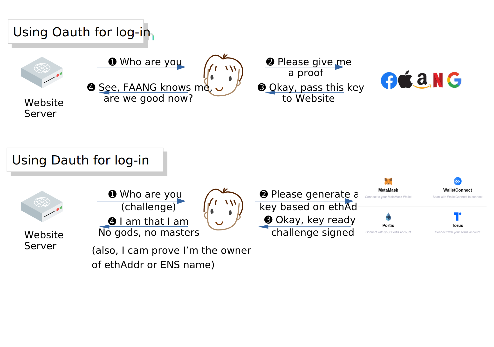

# Dauth, an Oauth-based login protocol

## Overview

Dauth (decentralised authentication) provides Web2 developers with a login and authentication method based on Oauth and the password-less Ethereum cryptography. It will use the same Oauth API formats and similar communication flow that Web2 developers are already familiar with, as well as its key management principles. This method is superior to logging in through signing a message with an Ethereum key because of the following reasons.

**1. Privacy**: Users can *either* a) login **anonymously** *or* b) bind the login session with an Ethereum Address / ENS name. If the user logs in anonymously, the website does not learn the user's Ether balance or token holding. And during the session, if the user chooses to identify themselves with his Ethereum address and/or ENS name, they can do so by providing a proof, without changing the session or authentication key.

**2. Security**: The user's Ethereum key is not directly used. Instead, a *refresh key pair* is generated for each session and not shared between websites. This 1) prevents man-in-the-middle attack, where the attacking website forwards the login challenge from another site to itself; 2) allows the key pair to be revoked, so the user can stop stolen devices to stay in the login session; 3)  by using one key pair per site, if the keys are compromised, its originating Ethereum key is not, therefore, the safety of crypto assets is not affected.

**3. Decentralisation**: No other servers are involved when a webserver allows users to log in using ETH Address. However if ENS is used, a node is involved. Through cryptography, instead of smart contract, there is no Ethereum smart contract required except the already-deployed ENS contract for the ENS using cases, hence allowing less centralised management.

**4. User Experience** (though optional wallet extension): Through a wallet extension, the user can revoke the live sessions on a stolen device despite not having a centralised entity such as FATG having logged in, The same extension also allows the wallet to be smarter, managing how long the session remains active depending on how safe the environment is. This is not part of the deliverables of this project but remain as a design decision to allow future enhancement.

## High-level Mechanism

Terms:

Server
: In Dauth only one web server is involved, which is the web server of the website the user logs in to. Hence, 'server' always refer to the website's server.

Client
: The Dauth library at work in the client (browser) side. For wallets that support native Dauth, this code works in the wallet; for wallets without Dauth support, JavaScript library code works in the browser, with access to the user's wallet.

### Login

The first time a user logs in to a new website on a new device, the webserver creates a challenge and shares this with the user client. The user client then generates *refresh key pair* based on this challenge, the user's Ethereum signing key, the website's domain name along with some high entropy randomness. The method to obtain such a key is discussed later. This key expires in a server-specified amount of time, for example, one week.

The client then creates and sends a response to the challenge with the following information:

- Refresh key's public key, together with proof that the key is generated from an Ethereum address (this address does not have to exist in the Ethereum blockchain, see the "anonymous login" section later) in response to the challenge.

- A signature using that key, proving to the server that the client has the private key of the refresh key. 

### Session Management

When a user wishes to log in to the website, an HTTP request is sent to the server, it comes with a JSON authentication token, which contains an 'access token', which is the signature of the timestamp in the HTTP request by the *refresh key*. This means, that after initally logging in to a website the user does not need to use their Ethereum key again, only the *refresh key*.

The client should keep the *refresh key* to provide a different access token each time the user needs to access a resource. 

Optionally, at any time the user might want to log in, it can chose to shares its ENS name. This binds the *refresh key* to the ENS name instead of the Ethereum address, allowing the user to change the Ethereum address later. Any relevant account metadata is provided at this opportunity, such as attestation from 3rd party - e.g. this Ethereum address is held by a recent Olympic Games Tokyo athlete.

This information unambiguously associates the user's session with said Ethereum address.

For clients with a Dauth compatible wallet, the *refresh key* is kept in the wallet until it expires. The wallet's policy decides whether or not the user is still the same user, and the key should be kept in use. For example, suppose a user enabled a mobile phone with fingerprint authentication or face-recognition authentication. In that case, the wallet knows when it's the same user, so it should use the same *refresh key* without the user logging in again. This is an improvement over today's Oauth based solutions.

For clients without a Dauth compatible wallet, a JavaScript library provided to the web developer will be at work to determine if the key should still be kept or discarded, based on the website's policy. This is a similar situation to today's Oauth based website.

### Anonymous authentication

This protocol supports anonymous authentication and adaptive identification. In plain words:

- A user can sign up as an anonymous user and log in as an anonymous user, simply by not linking their identity with any Ethereum address at use. The user will still be identified by a seemingly random Ethereum address, except that this address will never hold any Ether or be used for smart contracts. 
- However, this seemingly random Ethereum address is determined by an actual Ethereum address which may hold assets, tokens or ENS names. Hence the address will actually be the same across different sessions on different devices, even for different *refresh keys*. This means that if a user has a wallet on multiple devices, they are able to authenticate anonymously to a website on _all_ their devices.

This provides adaptive identification. For example, a user who visits an forums website to read a discussion on their mobile device. At first they do not want to be identified but still desires convenient login based on their Ethereum key. Later, when the user starts to be interested in community participation, such as leaving a comment, they would want to be identified. They can submit their Ethereum address using their laptop and cryptographically prove that they have always been the owner of that Ethereum address. The anonymous identity was constructed based on this, for precisely this website. 

### Revocation

Even if the user has chosen to remain anonymous, but lose a device containing the private *refresh key*, they are able to revoke access to previous refresh keys using another device. All they need is access to their Ethereum key. They do this by simply signing a revocation request using the seemingly random Ethereum key (that unquely identifies the user) which they generated from their true Ethereum key when they initially accessed the website.
This signature proves that they are the true owner of the account. Even so, this still does not leak the user's true Ethereum address to the website. 

## Work plan

- The *refresh key* generation method is a cryptographic protocol that has to be developed and scrutinised. Most simply, the key is either derived from the user's Ethereum address using the website's domain name and the challenge as a derivation factor or ccreated from the signature on such a derivation factor. In any way, the security of it has to be described separately and proved.
- The communication protocol, largely based on Oauth, needs to be defined and tested with web2 developers to determine if it is easy to adopt.
- A wallet extension needs to be defined and implemented in one of the opensource Ethereum wallets. This extension is not required for Dauth to work, but it improves security and user experience.
- A JavaScript package needs to be developed for web2.0 developers to adopt Dauth similarly to Facebook/Google's Oauth 2.0.
- A backend package that can verify the signature, as well as the *refresh key*'s public key, is correctly constructed for the current website domain. Such a package may need to be in both JavaScript and PHP.

## FAQ

### How is Oauth used in this protocol

- Oath's concept of refresh token and access token to secure sessions is used in this protocol. We modified the refresh token to an asymmetric key pair, whose public key is used in place of Oauth's refresh token.
- We re-use the concept of "magic links" to forward authentication tokens in Oauth's native format. Although forwarding tokens through links is not technically needed, since there is no centralised authentication provider, the look-and-feel of it is retained to make Web2 developers comfortable.
- The communication flow of Oauth has authentication delegated to the centralised authentication provider, and the token is passed back to the website. Such a flow is mirrored by replacing such a provider with a wallet.

Together, this creates a decentralised login process that has Oauth's look and feel, a flow mirroring Oauth and a data set based on Oauth's native data format in a trustless, decentralised environment where a confidential 3rd party authentication provider does not exist.

### How is "silent login" achieved

The goal is to build session management in the protocol so that the user does not get kicked out for not being active on a web page for a few minutes. This is achieved by having a long-lived (1 to 2 weeks) *refresh key* that stays with the browser. As long as the environment remains secure, the browser should know the key is kept alive and keep producing access tokens for accessing resources.

### What if the user's device is compromised

It's assumed that a compromised device leads to compromised sessions, but not a compromised wallet. If a user's mobile phone is lost, the user can restore their wallet on another device, log in to the same website and choose to disable any other session. This expires the *refresh key* from the server-side; therefore any other active session users will be 'kicked out', and need to create a new *refresh key*. Since creating a new refresh key depends on accessing the Ethereum address' private key, the person who stole the device can't resume the session.

### Is the underlying cryptography sound?

It is crucial that the *refresh key pair* is created securely. The exact algorithm is to be developed, with minimal models already existing pending further proof. An earlier algorithm is described in [an earlier version of this draft](Dauth-without-session-mgmt.md). The team working on this is the same set of people who worked on the zk identifier attestation protocol to be used in the Devcon ticket attestations and various other cryptographic endeavours. 

## Technical Specification

Assume the user's Ethereum key of their address is denoted by as `sk` and hence that its corresponding public key is `pk=G*sk`. That is, `G` is the generator for secp256k1 ECDSA. We assume the address of this public key is computed through a function `addr`, i.e. the user's address is `addr(pk)`.

### User trying to log in for the first time

The first time the user wants to log in to a website with the domain `domain`, derive a delegated Ethereum key using `domain` as the derivation factor based on their private Ethereum key `sk`. This can for example be done using BIP-32. Denote the private part of this delegated key by `d`, denote the public part of they key by `D=G*d`. This public key will uniquely identify the user across sessions and devices.

Using `d` the user derives yet another key pair, which will be the *refresh key pair*.
To do so they receive a challenge `e` from the website and derive a random number `f=Keccak(d)`. 
 They then compute the private *refresh key* as `r=d+Keccak(addr(pk),domain,e,f)` and a corresponding public *refresh key* `R=G*(d+Keccak(addr(pk),domain,e,f))`.

The user then signs the public delegated key, the public *refresh key* and the server challenge with both the private delegated key and the private *refresh key*. That is, the user computes `a=sign(d, (D, R, e))` and `b=sign(r, (D, R, e))`. Finally the user sends `a, b, D, R` to the website.
The website verifies the signatures and creates an account linked to `D` with a *refresh key* `R` and furthermore stores `e`.
The user stores `D, R, r, e`, and hence the only secret information it keeps is the private *refresh key*.

Note that now the private delegated key `d` can be deleted from memory, since it will only be required again when new refresh keys needs to be issued, or old refresh keys needs to be revoked. Both which are actions that require the user to access their wallet and hence their Ethereum account key. Thus the user can just generate `d` again when needed.

### User subsequently logs in to a website
The user wants to log in to a website with domain `domain` for which they have previously constructed a *refresh key* pair.
In this case the user simply asks the website for a new unique challenge, `c`, and signs this using `r`. That is, `sign(r, c)`. The user returns the signature to the website, which then verifies this with `R` and that the challenge `c` is as expected.  

Note that in practice the user will actually sign the entire Oauth access token and `c` the Oauth challenge code.

### User shares ENS 
If the user wants to share their Ethereum identity with the website, they again ask the website for a new unique challenge `c`. The user then computes a personal signature on this challenge and the delegated public key `D` using its private Ethereum key, that is `g=sign(sk, (c, D))`. The user then shares `f`, `g` and `addr(pk)` with the website. The site then derives the user's candidate public key from `g` and checks that `pk=D+G*Keccak(addr(pk),domain,e,f)`. If so, it accepts the delegated key `D` is associated with the user's true Ethereum address `addr(pk)`.

Note that instead of `addr(pk)` the user's ENS can simply be used instead.

### User revokes refresh key
If a user's private *refresh key* has been compromised, they can issue a request to revoke _all_ previous *refresh keys* using their delegated Ethereum key. 
Concretely the user reconstructs the private delegated key `d` using `domain` and their private Ethereum key `sk`. Then they simply sign a message containing a `revoke` command, a `timestamp` and the public delegated key `D`, using `d` and shares this with the webserver. That is, they share the signature `sign(d, (revoke, timestamp, D))`.
The webserver will then discard any public *refresh key* `R` it has associated with `D`. Afterwards the user can construct a new *refresh key* pair.

Note that the reason _all_ previous refresh keys are revoked is because we don't assume any way of synchronising different refresh keys (and the random numbers used to construct them) between different devices.

### Security observation
The crux of the specification is the following:

1. The user proves ownership of the *refresh key* by signing the challenge `c` provided by the website.

2. The website cannot brute-force the user's address due to the unpredictability of the value `f`.

3. The *refresh key* has been linked to their Ethereum address from the get-go. This is achieved since the user "commits" to the domain-specific delegated key `D`, and the rest of the *refresh key*, `Keccak(addr(pk),domain,e,f)` is uniquely determined in a way that is publicly discloseable but also unpredictable (before disclosure).
